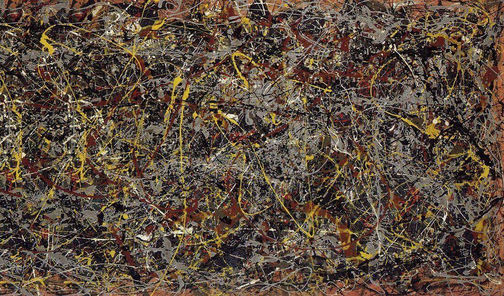

# AI-Generated-Styled-Images

+ Fall 2020
+ Team members
	+ Yue Liang
	+ Levi Li
	+ Michael Petkun
	+ Yuqing Chen
  
+ Project summary: 
  + In this project, we use the VGG19 neural network for neural transfer learning, in order to combine two images by extracting the content of one and the style of another. We create our own model with adjustable hyperparamters and with our choice of content and style images, and we explore and discuss how changes in target image initialization, random seed, content loss weight (α), style loss weight (β), and training steps affect the target image. We also experiment with many different style images, finding that styles with distinctive color palettes and textures work best in our model. We end with a summary of key takeaways and a discussion of avenues for future research.
  + Our result:
  
    Content Image
    
    
    
    
    Style Image
    
    
    
    
    Combined Styled Image
    
    
    

